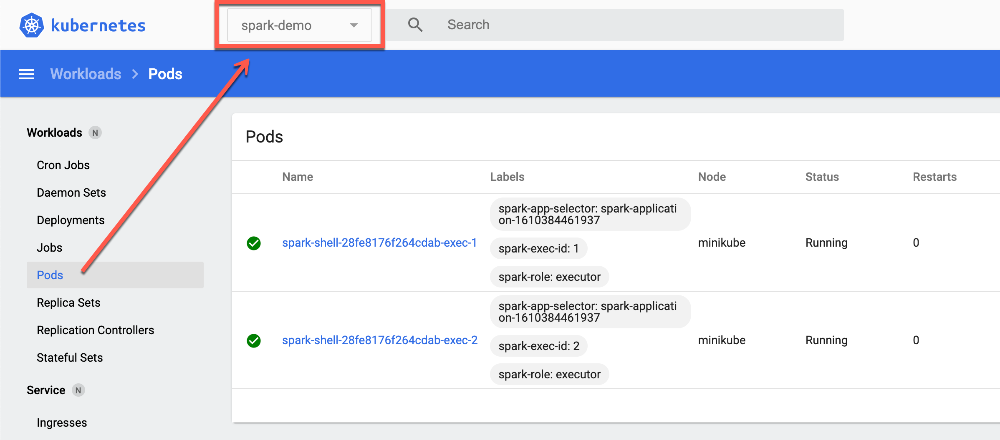

---
hide:
  - navigation
---

# Demo: spark-shell on minikube

This demo shows how to run `spark-shell` on [minikube](https://minikube.sigs.k8s.io/docs/) that touts itself as:

> minikube quickly sets up a local Kubernetes cluster on macOS, Linux, and Windows.

!!! note
    `k` is an alias of `kubectl`.

## Start minikube

Quoting [Prerequisites]({{ spark.doc }}/running-on-kubernetes.html#prerequisites) in the official documentation of Apache Spark:

> We recommend 3 CPUs and 4g of memory to be able to start a simple Spark application with a single executor.

Let's start `minikube` with the recommended resources.

```text
minikube start --cpus 4 --memory 8192
```

## Review Cluster Info

### Cluster Info

```text
k cluster-info
```

```text
k config view
```

### Pods

List available pods. There should be none except Kubernetes system pods (and that's the reason for `-A` to include all pods, including system's).

```text
k get po -A
```

```text
NAMESPACE     NAME                               READY   STATUS    RESTARTS   AGE
kube-system   coredns-74ff55c5b-vqm2f            1/1     Running   0          2m3s
kube-system   etcd-minikube                      1/1     Running   0          2m18s
kube-system   kube-apiserver-minikube            1/1     Running   0          2m18s
kube-system   kube-controller-manager-minikube   1/1     Running   0          2m18s
kube-system   kube-proxy-ms4wd                   1/1     Running   0          2m4s
kube-system   kube-scheduler-minikube            1/1     Running   0          2m18s
kube-system   storage-provisioner                1/1     Running   0          2m18s
```

### Container Images

List available Docker images in minikube's Docker registry.

Point the shell to minikube's Docker daemon.

```text
eval $(minikube -p minikube docker-env)
```

List available container images.

```text
docker images
```

```text
REPOSITORY                                TAG        IMAGE ID       CREATED         SIZE
k8s.gcr.io/kube-proxy                     v1.20.2    43154ddb57a8   12 days ago     118MB
k8s.gcr.io/kube-controller-manager        v1.20.2    a27166429d98   12 days ago     116MB
k8s.gcr.io/kube-apiserver                 v1.20.2    a8c2fdb8bf76   12 days ago     122MB
k8s.gcr.io/kube-scheduler                 v1.20.2    ed2c44fbdd78   12 days ago     46.4MB
kubernetesui/dashboard                    v2.1.0     9a07b5b4bfac   6 weeks ago     226MB
gcr.io/k8s-minikube/storage-provisioner   v4         85069258b98a   7 weeks ago     29.7MB
k8s.gcr.io/etcd                           3.4.13-0   0369cf4303ff   5 months ago    253MB
k8s.gcr.io/coredns                        1.7.0      bfe3a36ebd25   7 months ago    45.2MB
kubernetesui/metrics-scraper              v1.0.4     86262685d9ab   10 months ago   36.9MB
k8s.gcr.io/pause                          3.2        80d28bedfe5d   11 months ago   683kB
```

### Kubernetes Dashboard

```text
minikube dashboard
```

## Build Spark Image

Quoting [Submitting Applications to Kubernetes]({{ spark.doc }}/running-on-kubernetes.html#submitting-applications-to-kubernetes) in the official documentation of Apache Spark:

> Spark (starting with version 2.3) ships with a Dockerfile that can be used for this purpose, or customized to match an individual application’s needs. It can be found in the `kubernetes/dockerfiles/` directory.

In a separate terminal...

```text
cd $SPARK_HOME
```

!!! tip
    Review `kubernetes/dockerfiles/spark` (in your Spark installation) or `resource-managers/kubernetes/docker` (in the Spark source code).

### docker-image-tool

Build and publish the Spark image. Note `-m` option to point the shell script to use minikube's Docker daemon.

```text
./bin/docker-image-tool.sh \
  -m \
  -b java_image_tag=11-jre-slim \
  -t v{{ spark.version }} \
  build
```

!!! note
    As of Spark 3.1.1, `java_image_tag` argument is assumed `11-jre-slim` (and so `-b java_image_tag=11-jre-slim` could've been skipped in the above command).

### docker images

Point the shell to minikube's Docker daemon.

```text
eval $(minikube -p minikube docker-env)
```

List the Spark image.

```text
docker images spark
```

```text
REPOSITORY   TAG          IMAGE ID       CREATED          SIZE
spark        v{{ spark.version }}   ad49befe3d09   19 seconds ago   509MB
```

### docker image inspect

Use [docker image inspect](https://docs.docker.com/engine/reference/commandline/image_inspect/) command to display detailed information on the Spark image.

```text
docker image inspect spark:v{{ spark.version }}
```

## Create Namespace

This step is optional, but gives a better exposure to the Kubernetes features supported by Apache Spark and is highly recommended.

!!! tip
    Learn more in [Creating a new namespace]({{ k8s.doc }}/tasks/administer-cluster/namespaces/#creating-a-new-namespace).

```text
k create ns spark-demo
```

Set `spark-demo` as the default namespace using [kubens](https://github.com/ahmetb/kubectx) tool.

```text
kubens spark-demo
```

## Spark Logging

Enable `ALL` logging level for Kubernetes-related loggers to see what happens inside.

Add the following line to `conf/log4j.properties`:

```text
log4j.logger.org.apache.spark.deploy.k8s=ALL
log4j.logger.org.apache.spark.scheduler.cluster.k8s=ALL
```

Refer to [Logging](../spark-logging.md).

## Launch spark-shell

```text
cd $SPARK_HOME
```

```text
K8S_SERVER=$(k config view --output=jsonpath='{.clusters[].cluster.server}')
```

```text
./bin/spark-shell \
  --master k8s://$K8S_SERVER \
  --conf spark.kubernetes.container.image=spark:v{{ spark.version }} \
  --conf spark.kubernetes.context=minikube \
  --conf spark.kubernetes.namespace=spark-demo \
  --verbose
```

Soon you should see the Spark prompt similar to the following:

```text
Welcome to
      ____              __
     / __/__  ___ _____/ /__
    _\ \/ _ \/ _ `/ __/  '_/
   /___/ .__/\_,_/_/ /_/\_\   version 3.1.1
      /_/

Using Scala version 2.12.10 (OpenJDK 64-Bit Server VM, Java 11.0.10)
Type in expressions to have them evaluated.
Type :help for more information.

scala> spark.version
res0: String = 3.1.1

scala> sc.master
res1: String = k8s://https://127.0.0.1:55020
```

## web UIs

Open web UI of the Spark application at http://localhost:4040/.

Review the pods in the [Kubernetes UI](#kubernetes-dashboard). Make sure to use `spark-demo` namespace.



## Scale Executors

Just for some more fun, in `spark-shell`, request two more executors and observe the logs.

```text
sc.requestTotalExecutors(numExecutors = 4, localityAwareTasks = 0, hostToLocalTaskCount = Map.empty)
```

```text
sc.killExecutors(Seq("1", "3"))
```

Review the number of executors at http://localhost:4040/executors/ and in the Kubernetes UI.

## Clean Up

```text
minikube stop
```

Optionally (e.g. to start from scratch next time), delete all of the minikube clusters:

```text
minikube delete --all
```
